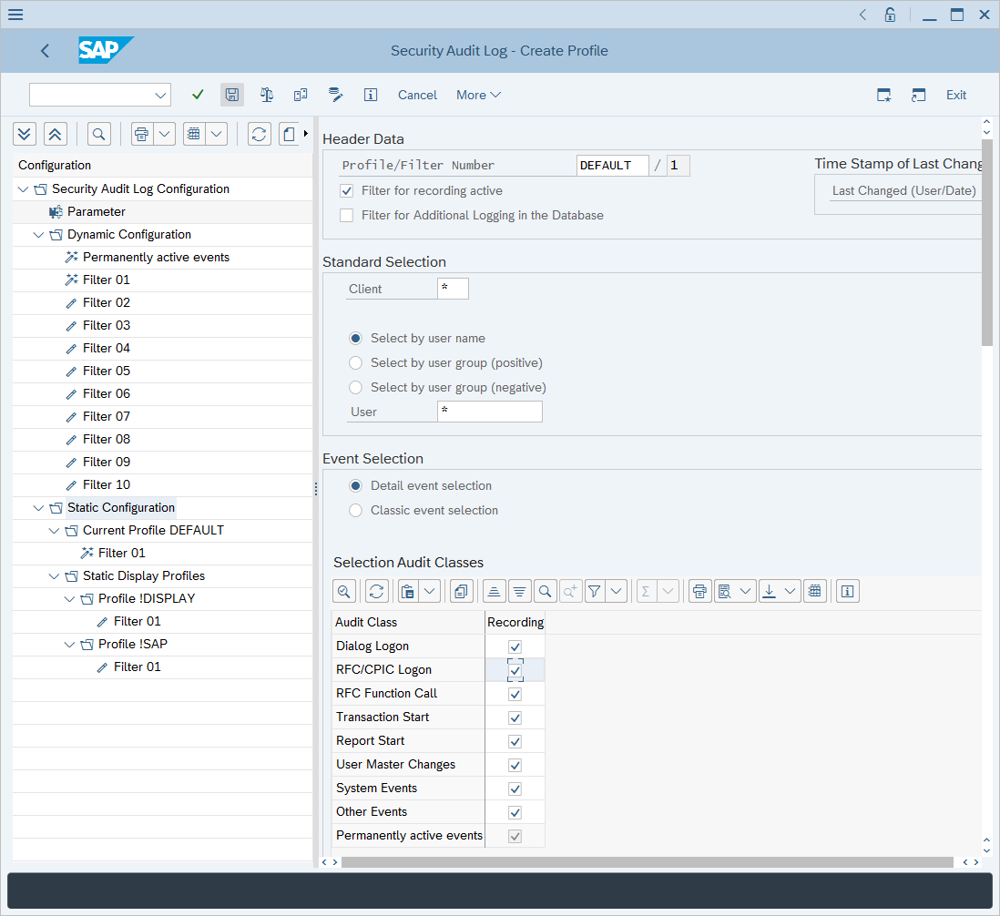

# Enable and configure SAP auditing for Microsoft Sentinel

This article shows you how to enable and configure auditing for the Microsoft Sentinel solution for SAP® applications, so that you can have complete visibility into your SAP solution.

> [!IMPORTANT]
> We strongly recommend that any management of your SAP system is carried out by an experienced SAP system administrator.
>
> The steps in this article may vary, depending on your SAP system's version, and should be considered as a sample only.

Some installations of SAP systems may not have audit log enabled by default. For best results in evaluating the performance and efficacy of the Microsoft Sentinel solution for SAP® applications, enable auditing of your SAP system and configure the audit parameters.

## Deployment milestones

Track your SAP solution deployment journey through this series of articles:

1. [Deployment overview](deployment-overview.md)

1. [Deployment prerequisites](prerequisites-for-deploying-sap-continuous-threat-monitoring.md)

1. [Work with the solution across multiple workspaces](cross-workspace.md) (PREVIEW)

1. [Prepare SAP environment](preparing-sap.md)

1. **Configure auditing (*You are here*)**

1. [Deploy data connector agent](deploy-data-connector-agent-container.md)

1. [Deploy SAP security content](deploy-sap-security-content.md)

1. [Configure Microsoft Sentinel solution for SAP® applications](deployment-solution-configuration.md)

1. Optional deployment steps   
   - [Configure data connector to use SNC](configure-snc.md)
   - [Collect SAP HANA audit logs](collect-sap-hana-audit-logs.md)
   - [Configure audit log monitoring rules](configure-audit-log-rules.md)
   - [Deploy SAP connector manually](sap-solution-deploy-alternate.md)
   - [Select SAP ingestion profiles](select-ingestion-profiles.md)

## Check if auditing is enabled

1. Sign in to the SAP GUI and run the **RSAU_CONFIG** transaction.

   

1. In the **Security Audit Log - Display of Current Configuration** window, find the **Parameter** section within the **Configuration** section. Under **General Parameters**, see that the **Static security audit active** checkbox is marked.

## Enable auditing

> [!IMPORTANT]
> Your audit policy should be determined in close collaboration with SAP administrators and your security department.

1. Sign in to the SAP GUI and run the **RSAU_CONFIG** transaction.

1. In the **Security Audit Log** screen, select **Parameter** under **Security Audit Log Configuration** section in **Configuration** tree.

1. If the **Static security audit active** checkbox is marked, system-level auditing is turned on. If it isn't, select **Display <-> Change** and mark the **Static security audit active** checkbox. 

1. By default, the SAP system logs the client name (terminal ID) rather than client IP address. If you want the system to log by client IP address instead, mark the **Log peer address not terminal ID** checkbox in the **General Parameters** section.

1. If you changed any settings in the **Security Audit Log Configuration - Parameter** section, select **Save** to save the changes. Auditing will be activated only after the server is rebooted.

   > [!IMPORTANT]
   > SAP applications running on Windows OS should consider recommendations in SAP Note 2360334 in case the audit log isn't read correctly after setup.

   

1. Right-click **Static Configuration** and select **Create Profile**.

    

1. Specify a name for the profile in the **Profile/Filter Number** field. 

   > [!NOTE]
   > Vanilla SAP installation requires this additional step: right-click the profile you have created and create a new filter.

1. Mark the **Filter for recording active** checkbox.

1. In the **Client** field, enter `*`.

1. In the **User** field enter `*`.

1. Under **Event Selection**, choose **Classic event selection** and select all the event types in the list. 

1. Select **Save**.

    

1. You'll see that the **Static Configuration** section displays the newly created profile. Right-click the profile and select **Activate**.

1. In the confirmation window select **Yes** to activate the newly created profile.
   > [!NOTE]
   > Static configuration only takes effect after a system restart. For an immediate setup, create an additional dynamic filter with the same properties, by right clicking the newly created static profile and selecting "apply to dynamic configuration". 

## Next steps

In this article, you learned how to enable and configure SAP auditing for Microsoft Sentinel.

> [!div class="nextstepaction"]
> [Deploy and configure the container hosting the data connector agent](deploy-data-connector-agent-container.md)
